<!-- ======================================================= -->
<!-- SECCIÓN 1: ENCABEZADO, PERFIL Y CONTACTO               -->
<!-- ======================================================= -->

<div align="center">

  <!-- Banner de fondo -->
  
  
  <br />

  <!-- Nombre principal sin línea divisoria -->
  <!--
  <h3 style="font-size: 2.2em; font-weight: 700; margin-top: 10px; margin-bottom: 5px; border: none; padding-bottom: 0;">
    Adriana Castillo
  </h3>
  -->
  
  <!-- Rol + LinkedIn sin línea divisoria -->
  <h1 style="font-size: 1.3em; font-weight: 500; margin-top: 0px; margin-bottom: 15px; border: none; padding-bottom: 0;">
    Software Engineer & Data Engineer &nbsp;&nbsp;
    <a href="https://linkedin.com/in/adriana-castillo-c" target="_blank">
      
    </a>
  </h1>

  <!-- Badges de Tecnologías Principales -->
  <p align="center">
    
    
    
    
    
    
  </p>
  <br />

</div>

<br />

<!-- ======================================================= -->
<!-- SECCIÓN 2: TERMINAL MACOS (PROFILE JSON COLOREADO)      -->
<!-- ======================================================= -->

<p align="center">
  
</p>

<br />

<!-- ======================================================= -->
<!-- SECCIÓN 3: TECH STACK & CAPABILITIES                    -->
<!-- ======================================================= -->

### Tech Stack & Capabilities
<br />

```Ini, TOML
[INFO] Loading developer profile: adri-castillo
  [✔] Full Stack    -> Node.js  |  Angular  |  TypeScript  |  RESTful APIs  |  HTML5/SCSS
  [✔] Data Eng      -> Python  |  Apache Spark  |  Hadoop (HDFS)  |  Apache NiFi  |  Pandas
  [✔] AI & DS       -> TensorFlow  |  Deep Learning (LSTM)  |  Scikit-learn  |  Web Scraping
  [✔] Databases     -> PostgreSQL  |  MongoDB  |  SQL Server  |  MySQL
  [✔] DevOps        -> Docker  |  Git  |  Linux / Bash  |  Postman
[READY] System operational.
```
<br />
<!-- ======================================================= -->
<!-- SECCIÓN 4:  GITHUB STATS                                -->
<!-- ======================================================= -->

### GitHub Activity

<br />

<p align="center">
  
</p>
